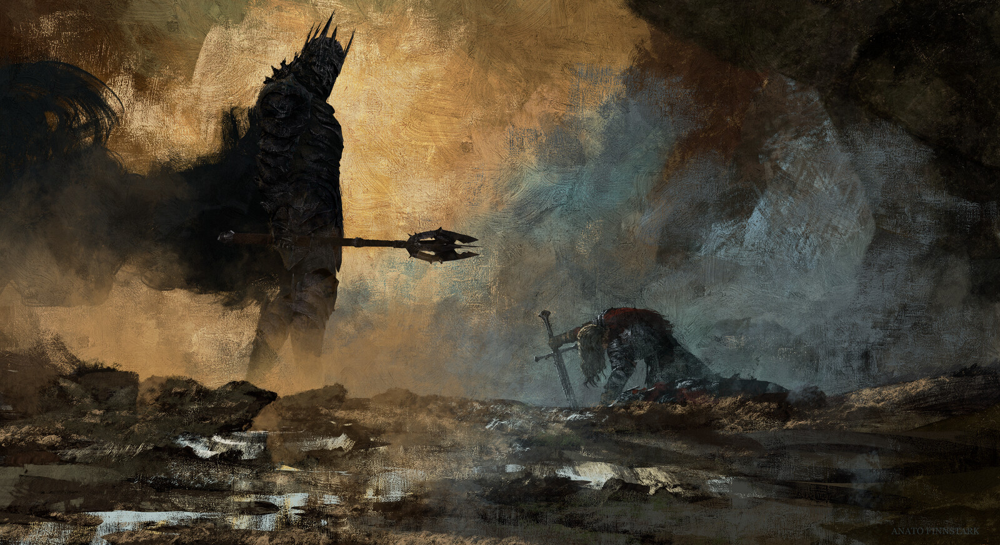

# Projeto Final C207L1 C206L1

## Descrição
Este projeto tem como objeto exaltar a beleza das obras da Terra Média de J.R.R Tolkien .
Ele foi baseado nas obras da Segunda Era, na batalha da Última Aliança, onde, pela Homens e Elfos se uniram pela última vez, antes dos acontecimentos da Guerra do Anel e da Sociedade do Anel na trilogia O Senhor dos Anéis, para combater as forças de Sauron em Barad-dûr
Depois de uma batalha que levou a morte do rei dos homens, Isildur o então príncipe e futuro rei, usou a espada de seu pai para derrotar Sauron, cortando o Um Anel de seu dedo.

  

## Critérios
Foram feitas algumas aplicações no projeto com base na ementa curricular de C206 e C207 como:
- Classes;
- Classes Abstratas;
- Herança;
- Polimorfirmos;
- Interfaces;
- Maven;
- CRUD;
- Relacionamentos;

## Funcionalidades
- O código as características do seu personagem e dos inimigos que você enfrentar;
- Encena a batalha e atualiza os dados equanto os exibe no console;
- Exibe o resultado final da batalha, com a contagem de cada exército;

